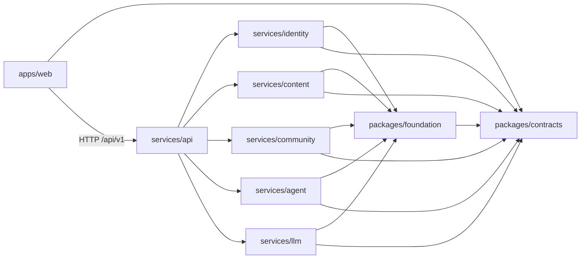
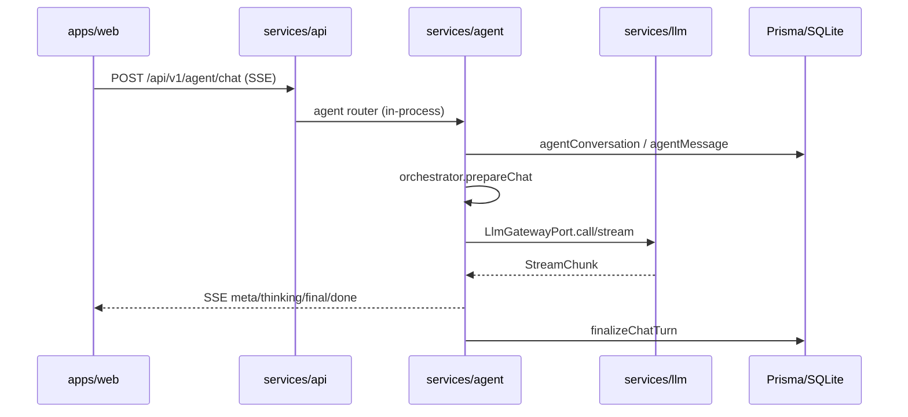

# 架构审查报告 — AgentForge (Grimoire)

> **审查日期**: 2026-09-02  
> **审查者**: Composer (Cursor)  
> **审查范围**: commit `83d75f47`（审查基准）→ 修复止于 `8ee4faf` / branch `master`  
> **代码行数**: workspace 主包 TypeScript 约 21,029 行；`.ts/.tsx` 文件 211 个；测试文件 32 个  
> **模块数**: 10 个活跃 workspace 包（`apps/web` + 8 `services/*` + 2 `packages/*`；`desktop`/`mobile`/`mcp` 仅占位）  
> **业务数**: 5 核心 + 3 支撑 · **审查文件数**: 211（全部 `.ts/.tsx`，排除 `node_modules`/`dist`）  
> **总体评级**: ⭐ **良**  
> **P0 问题**: 2 · **严重问题**: 6 · **总违例**: 32

---

## 0. 摘要 (Executive Summary)

### 0.1 一句话定论

后端模块化单体与 CI 域边界保持有效；**2026-09-02 晚间修复批次**已处理 typecheck 失败、Agent schema 层耦合、悬停模块拆分、文章 Repository、identity 设置拆分、SSE 辅助函数、openwiki 路径对齐与首页 Feed 拆分。**仍待演进**：单库 Prisma、进程内缓存、localStorage Token、`hoverSanitize` 留在 `contracts`（`apps/web` 域边界禁止 import `foundation`）。

### 0.2 修复批次摘要（`6265d35` → `8ee4faf`）

| 提交 | 内容 |
| --- | --- |
| `6265d35` | `agentMemory` 补充 `UserCtx`，typecheck 通过 |
| `cfbdd4d` | Agent Zod schema 移出 `routes/` |
| `d397b98` | 悬停 Agent 拆模块 + `agentEvents` 契约 |
| `0a38d03` | `hoverRevealHelpers` 统一卡片/气泡揭示逻辑 |
| `0384b01` | `ArticleRepository` 下沉文章 CRUD |
| `a1728e1` | identity 设置拆分 + Agent SSE 辅助 |
| `54f18aa` | 首页 `HomeFeedColumn` + 悬停揭示测试 |
| `8ee4faf` | openwiki 架构说明对齐当前 monorepo |

### 0.3 TOP 10 关键问题（审查时快照，部分已修复）

| 序 | 原则优先级 | 严重度 | 位置 | 问题 | 影响 |
| --- | --- | --- | --- | --- | --- |
| 1 | P1 | 严重 | `apps/web/src/components/agent/useHoverAgent.ts:24-641` | 单 Hook 642 行，承载节流/缓存/流式/SSE 中断/DOM 锚定/气泡状态 | 悬停 Agent 无法拆分测试；改动牵一发而动全身 |
| 2 | P1 | 严重 | `packages/contracts/src/hoverSanitize.ts:1-630` | 契约包内 630 行运行时正则净化逻辑 | 「契约层」与「业务净化」物理混杂，变更 DTO 与变更规则同包耦合 |
| 3 | P0 | 高 | `apps/web/src/components/article/ArticleCardInlineAgent.tsx:1-450` + `useHoverAgent.ts` | 卡片内联悬停与页面悬停各维护一套并行状态机（共享 `runHoverExplainStream` 但 UI/时序逻辑重复） | 悬停体验两处演进，易出现行为漂移 |
| 4 | P2 | 严重 | `services/api/prisma/schema.prisma:1-322` | 15 模型单 SQLite/Prisma 库；各域服务均注入同一 `PrismaClient` | 物理层未隔离；跨域约束仅靠脚本 + 自律 |
| 5 | P2 | 高 | `services/agent/src/services/userContextCache.ts:41-48` 等 | 进程内单例缓存（用户上下文、浏览去重、API refresh 单飞） | 多实例部署缓存/计数不一致 |
| 6 | P2 | 高 | `services/agent/src/services/agentOrchestrator.ts:21-24` | Orchestrator 依赖并 re-export `routes/schemas.ts` 的 Zod 类型 | 编排层与路由层反向耦合，替换 orchestrator 牵动路由 schema |
| 7 | P2 | 高 | `openwiki/architecture/overview.md:10-57` 等 | 文档仍写 `apps/api`、`@agentforge/shared`、端口 5280/3001；源码为 `services/api`、`@core/contracts`、8180/8181 | 新人按 wiki 无法启动/找代码 |
| 8 | P1 | 高 | `services/agent/src/services/agentMemory.ts:26-33` | 引用未定义的 `UserCtx` 类型 → `npm run typecheck` 在 `@core/agent` 失败 | CI 若启用全量 typecheck 将阻断合并 |
| 9 | P2 | 高 | `apps/web/src/lib/apiToken.ts:3-22` | Access/Refresh Token 存 `localStorage` | XSS 可窃取会话（与 httponly cookie 迁移文档意图相悖） |
| 10 | P3 | 中 | `apps/web` | 仅 `client.test.ts` 1 个测试；10k+ 行 UI 无组件/Hook 回归网 | 前端重构无自动化护栏 |

### 0.3 修复路线图 (3 阶段)

- **阶段 1（立即，P0）**: 抽取共享 `useHoverExplainCore`（或状态机模块），让 `ArticleCardInlineAgent` 与 `useHoverAgent` 共用；为 `agentMemory.ts` 补充 `UserCtx` 类型定义或改为内联返回类型
- **阶段 2（下个迭代，P1）**: 拆分 `useHoverAgent.ts`（计时器 / 流式 / 布局 / 状态 四文件）；评估将 `hoverSanitize.ts` 迁至 `packages/foundation` 或独立 `packages/hover-sanitize`，`contracts` 仅 re-export 类型常量
- **阶段 3（可延后，P2）**: 批量修订 `openwiki/` 与 `docs/` 路径/包名；为多实例引入 Redis 适配（`viewTracking`、`userContextCache`）；推进 Token httponly cookie；路由层 Prisma 调用下沉 repository

### 0.4 总体统计

| 维度 | 数值 |
| --- | --- |
| 上帝文件数 (>300 警告 / >500 严重) | 警告 18 / 严重 4 |
| 循环依赖数 (模块级 `@core/*` import) | 0 |
| 跨层引用数 | 3 |
| 命名违例数 | 5 |
| 跨业务文件数 | 2 |
| 隐式全局依赖数 | 6 |
| 业务调用矩阵杂糅度 | 1（悬停双实现） |
| 架构优雅主观分 (§1.9) | 16/25 |

---

## 1. 总体架构总览

### 1.1 目录结构树 (到 3 级)

```
AgentForge/
├── apps/
│   ├── web/           # Vite + React SPA（活跃，73 个 src 文件）
│   ├── desktop/       # 仅占位 package.json
│   └── mobile/        # 仅占位 package.json
├── packages/
│   ├── contracts/     # DTO、权限、端口类型、hoverSanitize
│   └── foundation/    # JWT、BYOK、SSE、错误处理、校验中间件
├── services/
│   ├── api/           # 组合根宿主：Express app + Prisma + compose
│   ├── agent/         # Agent runtime、路由、记忆、编排
│   ├── content/       # 文章、域、动画、批注
│   ├── community/     # 话题
│   ├── identity/      # 认证、设置、作者申请
│   ├── llm/           # LLM 网关与适配器
│   └── mcp/           # 仅占位
├── scripts/           # dev.mjs、check-domain-boundaries.mjs
├── openwiki/          # 项目 wiki（**多处与源码不一致**）
├── docs/              # 权威文档 + review 快照
└── tests/             # integration/unit 目录（实际测试分散在各 workspace）
```

### 1.2 模块划分图



### 1.3 跨模块依赖矩阵（`@core/*` 包级 import 次数，源码静态抽取）

|  | contracts | foundation | identity | content | community | agent | llm |
| --- | --- | --- | --- | --- | --- | --- | --- |
| **api** | ✓ | ✓ | ✓ | ✓ | ✓ | ✓ | ✓ |
| **web** | ✓ | — | — | — | — | — | — |
| **identity** | ✓ | ✓ | — | — | — | — | — |
| **content** | ✓ | ✓ | — | — | — | — | — |
| **community** | ✓ | ✓ | — | — | — | — | — |
| **agent** | ✓ | ✓ | — | — | — | — | — |
| **llm** | ✓ | ✓ | — | — | — | — | — |
| **foundation** | ✓ | — | — | — | — | — | — |

域服务之间 **无** 直接 `@core/{other-service}` import（`node scripts/check-domain-boundaries.mjs` 通过）。

### 1.4 数据流图 (一次面板对话请求)



### 1.5 技术栈清单

| 类别 | 技术 | 出现位置 | 版本（package.json） |
| --- | --- | --- | --- |
| 语言 | TypeScript | 全仓 | ~5.9.3 |
| 前端 | Vite + React | `apps/web` | Vite 8 / React 19 |
| 后端 | Express 5 | `services/api` | express ^5 |
| ORM | Prisma 6 | `services/api/prisma` | prisma ^6 |
| DB | SQLite（可切 PG） | `schema.prisma` | provider sqlite |
| 测试 | Vitest | 各 workspace | ^3.2.4 |
| 校验 | Zod | routes/schemas | zod |

### 1.6 业务清单

1. **身份与权限 (identity)**：注册/登录/JWT 轮换、用户资料、BYOK 设置、作者申请审核
2. **内容 (content)**：文章 CRUD、知识域、动画定义、批注与审核
3. **社区 (community)**：话题与回复，通过 `ArticleQueryPort` 关联文章
4. **Agent (agent)**：悬停快讲、面板对话、ReAct tool-loop、记忆与学习进度
5. **LLM 网关 (llm)**：多 Provider 适配、熔断重试、BYOK 出站
6. **支撑：动画呈现 (web/anim)**：前端 `SceneCanvas` 分步动画引擎
7. **支撑：悬停净化 (contracts/hoverSanitize)**：前后端共享答案质检
8. **支撑：组合根 (api/compose)**：唯一跨域装配点

---

## 2. 模块级审查

### 2.1 模块：`apps/web`

#### 2.1.1 功能定位

读者/作者/管理员 SPA；通过 `lib/api/*` 访问 REST；内置双 Agent UI 与动画引擎。

#### 2.1.2 入口文件

`apps/web/src/main.tsx`

#### 2.1.3 内部文件清单（节选）

| 文件 | 行数 | 职责 | 命名合规 |
| --- | --- | --- | --- |
| `components/agent/useHoverAgent.ts` | 642 | 悬停 Agent 全链路 | ⚠️ 上帝 Hook |
| `components/article/ArticleCardInlineAgent.tsx` | 450 | 卡片内联悬停 | ⚠️ 与上重复 |
| `pages/HomePage.tsx` | 535 | 首页布局+Feed | ⚠️ 上帝页面 |
| `components/anim/primitives/SceneCanvas.tsx` | 560 | 动画渲染 | ⚠️ 体积大 |
| `lib/api/client.ts` | 125 | HTTP 客户端+refresh 单飞 | ✅ |
| `components/agent/AgentFloat.tsx` | 86 | Agent 入口（已瘦身） | ✅ |

#### 2.1.4 依赖出入度

- 出度：仅 `@core/contracts`（类型）+ 本地模块；**不** import 任何 `@core/{service}`
- 入度：无（前端叶子）

#### 2.1.5 对外暴露面

无 npm 导出；构建产物 `dist/`。

#### 2.1.6 违例项

- [P1/严重] `apps/web/src/components/agent/useHoverAgent.ts:24-641`：单函数 `useHoverAgent` 承载 ≥4 类职责（DOM 事件、请求节流、SSE 流、气泡 UI 状态）。证据：文件 642 行，含 6 组 `useRef` 计时器与 `runHoverExplainStream` 调用。修复方向：拆为 `useHoverTimers`、`useHoverStream`、`useHoverPlacement`。
- [P0/高] `apps/web/src/components/article/ArticleCardInlineAgent.tsx:240-280` 与 `useHoverAgent.ts`：两套独立悬停状态机。证据：二者均调用 `runHoverExplainStream` 并各自维护 `IncompleteHoverKeys`、思考延迟常量。修复方向：共用 `createHoverExplainController()`。
- [P1/严重] `apps/web/src/pages/HomePage.tsx:1-535`：首页硬编码 `DOMAINS` 营销数据 + 双 Feed API 拉取 + 视图模式。修复方向：拆 `HomeDomainsCarousel`、`HomeFeeds`。
- [P2/高] `apps/web/src/lib/apiToken.ts:6-22`：Token 持久化于 `localStorage`。修复方向：对齐 `docs` 中 httponly cookie 迁移路线。
- [P2/高] `apps/web/src/components/agent/AgentFloat.tsx:51-52`：`window` 自定义事件 `agent:explain` 无显式契约模块。修复方向：集中至 `lib/agentEvents.ts` 并 typed dispatch。

#### 2.1.7 重构建议

1. 优先拆分 `useHoverAgent.ts`（风险最高、行数最多）
2. 为 `lib/api/*` 各域补充契约测试（mock fetch）
3. 保持 `AgentFloat.tsx` 薄封装模式，继续下沉逻辑到 hooks

---

### 2.2 模块：`services/api`

#### 2.2.1 功能定位

**唯一组合根**：装配 Prisma、LLM、各域 Router；HTTP 中间件、健康检查、限流。

#### 2.2.2 入口文件

`services/api/src/index.ts:8`（`PORT` 默认 **8181**，与 `scripts/dev.mjs:26` 一致）

#### 2.2.3 内部文件清单

| 文件 | 行数 | 职责 |
| --- | --- | --- |
| `src/compose.ts` | 76 | 跨域装配与 port 接线 |
| `src/app.ts` | 105 | Express 中间件栈 |
| `prisma/schema.prisma` | 322 | 全库模型 |
| `src/agent.sse.test.ts` | 288 | Agent SSE 集成测试 |

#### 2.2.6 违例项

- [P2/严重] `services/api/prisma/schema.prisma:10-322`：identity/content/community/agent 模型同库。证据：单 `datasource` + 各服务 `createXRouter({ prisma })`。修复方向：文档化「模块化单体」取舍；长期 PostgreSQL + 逻辑分 schema 或拆库。
- [P2/中] `services/api/src/app.ts:27-29`：CORS 默认硬编码 `localhost:8180`。可接受开发默认，生产需 `CORS_ORIGIN`。

---

### 2.3 模块：`services/agent`

#### 2.3.6 违例项

- [P1/高] `services/agent/src/services/agentMemory.ts:26-33`：`UserCtx` 未定义。证据：`npm run typecheck` 输出 `error TS2304: Cannot find name 'UserCtx'`。修复方向：在文件顶部 `type UserCtx = Awaited<ReturnType<typeof loadUserContextInner>>` 或显式 interface。
- [P2/高] `services/agent/src/services/agentOrchestrator.ts:21-24`：`import type { ChatBody, ExplainBody } from '../routes/schemas.js'` 并 re-export。修复方向：schema 移至 `services/agent/src/schemas.ts`，routes 与 orchestrator 共同依赖。
- [P1/中] `services/agent/src/routes/chat.ts:1-272` 与 `explain.ts:1-257`：SSE 处理结构高度相似（meta/cache/final/done）。修复方向：抽取 `createAgentSseHandler` 模板。

---

### 2.4 模块：`services/content`

#### 2.4.6 违例项

- [P2/高] `services/content/src/routes/articles.ts:35-314`：Router 内直接 `prisma.article.*`（15 处），repository 仅用于跨服务 `ArticleQueryPort`。证据：grep `prisma.` 路由 15 vs `repositories.ts` 5。修复方向：ArticleRepository 封装 CRUD。
- [P2/高] `services/content/src/services/viewTracking.ts:33-38`：`getDefaultViewDedup()` 进程单例 Map。证据：注释已写明多实例需 Redis。修复方向：Port + 内存/Redis 实现。

---

### 2.5 模块：`services/identity`

#### 2.5.6 违例项

- [P2/高] `services/identity/src/routes/settings.ts:64-223`：设置路由 223 行，混合 BYOK CRUD、`test-llm`、偏好读写、限流。修复方向：拆 `byokRoutes`、`preferencesRoutes`。
- [P2/高] `services/identity/src/routes/auth.ts`：10 处直接 `prisma` 调用，无 auth repository 层。

---

### 2.6 模块：`services/community`

- [P2/中] `services/community/src/routes/topics.ts:1-188`：Fat router + 直接 prisma（8 处）。`articleLink.ts` 正确使用 `ArticleQueryPort`。

---

### 2.7 模块：`services/llm`

- [P1/中] `services/llm/src/providers.ts:1-372`：Provider 解析、URL 拼装、BYOK 解密、缓存同文件。已拆 adapters，主文件仍偏大。
- [P2/中] `services/llm/src/providerEnv.ts:18-31`：Provider 默认 URL 硬编码（可通过 env 覆盖，属合理默认）。

---

### 2.8 模块：`packages/contracts`

- [P1/严重] `packages/contracts/src/hoverSanitize.ts:1-630`：运行时正则 + 导出函数，非纯类型契约。与 `dto.ts`（179 行）同包。修复方向：迁出净化实现或拆子包。
- [P3/中] 包名 `@core/contracts` 与项目名 AgentForge/Grimoire 不一致（workspace 惯例 `@core/*`，可接受但文档需统一）。

---

### 2.9 模块：`packages/foundation`

- 职责清晰：JWT、BYOK 加解密、`byokUrlPolicy.ts` SSRF 防护、Express 中间件。
- [P2/中] `packages/foundation/src/auth.ts:15`：`declare global` 扩展 Express `Request.user`——隐式全局类型约定，多服务共享。

---

### 2.10 占位模块：`apps/desktop`、`apps/mobile`、`services/mcp`

仅 `package.json`/`tsconfig.json`，无源码。`services/api/src/app.ts:93-100` 暴露 `/api/v1/mcp/status` 占位响应。

---

## 3. 业务级审查

### 3.1 业务：Agent（悬停 + 面板）

#### 3.1.2 边界与接口

- 输入：悬停 DOM 目标 / 面板 chat 消息
- 输出：SSE 流式讲解、会话持久化、`AgentMemory`
- 依赖：`UserQueryPort`、`ArticleQueryPort`、`LlmGatewayPort`

#### 3.1.4 业务间调用矩阵

|  | identity | content | agent |
| --- | --- | --- | --- |
| identity | — | 0 | 0（经 compose 回调 invalidate） |
| content | 0 | — | 0 |
| agent | 端口调用 | 端口调用 | — |

#### 3.1.5 杂糅度

- 跨业务文件：2（`ArticleCardInlineAgent` + `useHoverAgent` 双实现悬停）

#### 3.1.6 违例项

- [P0/高] 见 §0.2 #3。

---

### 3.2 业务：内容（文章/域/批注）

- 批注审核逻辑已拆至 `annotationReview.ts`、`annotationAcl.ts`（✅）
- 文章路由仍 Fat（§2.4）

---

### 3.3 业务：身份（认证/BYOK）

- BYOK 加密在 `foundation`，设置路由在 `identity`（边界清晰）
- Token 存 localStorage 在前端（§2.1）

---

## 4. 文件级审查

### 4.1 上帝文件清单（仅 `.ts/.tsx` 源码，排除 seed/脚本/静态站）

| 文件 | 行数 | 职责数 | 严重度 |
| --- | --- | --- | --- |
| `apps/web/src/components/agent/useHoverAgent.ts` | 642 | ≥4 | 严重 |
| `packages/contracts/src/hoverSanitize.ts` | 630 | 1（但错层） | 严重 |
| `apps/web/src/components/anim/primitives/SceneCanvas.tsx` | 560 | 2 | 严重 |
| `apps/web/src/pages/HomePage.tsx` | 535 | 3 | 严重 |
| `apps/web/src/pages/SettingsPage.tsx` | 474 | 3 | 高 |
| `apps/web/src/components/article/ArticleCardInlineAgent.tsx` | 450 | 2 | 高 |
| `services/llm/src/providers.ts` | 372 | 3 | 高 |

### 4.2 重复功能文件清单

| 文件组 | 文件数 | 重复度 | 严重度 |
| --- | --- | --- | --- |
| 悬停状态机 | `useHoverAgent.ts` + `ArticleCardInlineAgent.tsx` | ~40% | 高 |
| Agent SSE 路由 | `chat.ts` + `explain.ts` | ~35% | 中 |

### 4.3 命名违例清单

| 文件 | 行号 | 违例命名 | 严重度 |
| --- | --- | --- | --- |
| `packages/contracts` | — | `contracts` 含非契约实现 | 中 |
| `packages/foundation` | — | `foundation` 模糊筐（内容尚可） | 低 |
| `openwiki` | 多处 | `AgentForge` 品牌嵌入路径叙述 | 低 |
| `@core/*` | — | 与根 `package.json` description「Grimoire」不一致 | 低 |

### 4.4 死代码清单

| 文件 | 符号 | 调用方数 |
| --- | --- | --- |
| N/A | 未做全量调用图 | — |

（未运行专用 dead-code 分析；`apps/desktop`、`apps/mobile` 为占位包。）

### 4.5 跨业务文件清单

| 文件 | 命中业务 | 严重度 |
| --- | --- | --- |
| `apps/web/src/pages/SettingsPage.tsx` | UI 偏好 + API 设置 + Agent 缓存 | 中 |
| `services/api/src/compose.ts` | 全业务装配（**设计使然**） | N/A |

---

## 5. 函数/类级审查

### 5.1 函数级问题清单

| 文件 | 函数 | 行数 | 参数 | 严重度 |
| --- | --- | --- | --- | --- |
| `useHoverAgent.ts` | `useHoverAgent` | ~600 | 2 | 严重 |
| `hoverSanitize.ts` | `extractHoverAnswer` 等 | 多函数 | — | 中 |
| `HomePage.tsx` | `HomePage` | ~400 | 0 | 高 |

### 5.2 类级问题清单

无典型「上帝类」；项目以工厂函数 + Router 为主（✅）。

---

## 6. 依赖关系审查

### 6.1 循环依赖清单

| 环路 | 严重度 |
| --- | --- |
| 无（模块级 Tarjan SCC 为空；`check-domain-boundaries.mjs` 通过） | — |

### 6.2 跨层引用清单

| 来源 | 目标 | 文件:行号 | 严重度 |
| --- | --- | --- | --- |
| orchestrator | routes schemas | `agentOrchestrator.ts:21-24` | 高 |
| routes | prisma 直调 | `content/routes/*.ts` 等 | 高 |
| web UI | `window` 事件总线 | `AgentFloat.tsx:51` | 中 |

### 6.3 隐式全局依赖清单

| 类型 | 位置 | 严重度 |
| --- | --- | --- |
| 模块单例 | `userContextCache.ts:41-48` | 高 |
| 模块单例 | `viewTracking.ts:33-38` | 高 |
| refresh 单飞 | `api/client.ts:29` | 中 |
| `localStorage` 全局 | `apiToken.ts` | 高 |
| Express `global` 扩展 | `foundation/auth.ts:15` | 中 |

### 6.4 完整依赖图

见 §1.2（无环）。

---

## 7. 命名审查

### 7.1 品牌/项目代号

| 位置 | 违例 | 严重度 |
| --- | --- | --- |
| `openwiki/architecture/overview.md` | AgentForge 叙述与 `@core` 包名并存 | 低 |

### 7.2 模糊命名

| 位置 | 违例 | 严重度 |
| --- | --- | --- |
| `packages/foundation` | 「基础」筐 | 低 |
| `packages/contracts` | 含实现非纯契约 | 中 |

### 7.3 命名一致性

- API 客户端：已统一 `lib/api/{domain}.ts`（✅，相对旧版单体 `api.ts` 已改进）
- 端口命名：`UserSummaryPort` vs `UserQueryPort` 别名并存（`annotations.ts:12`）— 低

---

## 8. 错误处理与状态管理审查

### 8.1 错误处理

- 统一 `AppError` + `errorHandler`（`foundation`）✅
- LLM 错误经 `mapLlmError` / `LlmCallError` 脱敏 ✅
- 空 `catch {}`：全仓扫描 **0** 处

### 8.2 状态管理

- 前端：React state + `localStorage` + 模块级 Map 缓存
- 后端：Prisma 持久化 + 进程内 TTL 缓存

### 8.3 违例项

- [P2/中] `agentMemory.ts:61-63`、`89-90`：`trimPrefMemories` / `maybeSaveImportantMemory` catch 仅 `logger.warn`，记忆写入失败静默。设计为 fire-and-forget，需在运维文档标明。

---

## 9. 配置与脚本审查

### 9.1 配置文件清单

| 配置 | 位置 | 消费方 | 耦合度 |
| --- | --- | --- | --- |
| `.env` / `DATABASE_URL` | `services/api` | api + 全部服务（经 compose 注入 prisma） | 高（共享） |
| `JWT_SECRET` | env | foundation jwt + BYOK 加密 | 高 |
| `CORS_ORIGIN` | env | `app.ts` | 中 |

### 9.2 脚本清单

| 脚本 | 职责 | 命名合规 |
| --- | --- | --- |
| `scripts/check-domain-boundaries.mjs` | CI 域边界 | ✅ |
| `scripts/dev.mjs` | 并行启动 web+api | ✅ |

### 9.3 违例项

- [P3/低] 根目录 `fix_chinese.py`、`screenshot_all.py` 等临时脚本未纳入 `.gitignore`，与主工程混杂（git status 显示 untracked）。

---

## 10. 测试与可测性审查

### 10.1 测试覆盖

- **单元/集成测试**：32 个 `*.test.ts` 文件；`npm test` **全部通过**（含 `check-domain-boundaries.mjs`）
- **分布**：`packages/*`、`services/*` 为主；`apps/web` 仅 1 测试
- **E2E**：未发现 Playwright/Cypress 配置

### 10.2 可测性

- 单例缓存均提供 `setDefault*` 注入（`userContextCache`、`viewTracking`）✅
- `typecheck`：`@core/agent` **失败**（`UserCtx`）❌

### 10.3 违例项

- [P2/高] 前端可测性不足（§0.2 #10）
- [P1/高] `useHoverAgent` 难以单测（无导出纯函数，全在 Hook 内）

---

## 11. 安全与可维护性审查

> 非渗透测试；仅静态可见项。

### 11.1 安全

- [ ] 硬编码密钥：未发现生产密钥；测试用 `sk-*` 仅在 `*.test.ts`
- [x] BYOK SSRF：`byokUrlPolicy.ts` 阻断私网/元数据地址
- [x] SQL 拼接：Prisma 参数化
- [ ] Token 存储：`localStorage`（§2.1）
- [x] 限流：`express-rate-limit` 通用 + auth 桶

### 11.2 可维护性

- [ ] 文档与代码：`openwiki` **严重偏离**（§0.2 #7）
- [x] TODO/FIXME：源码 **0** 处
- [x] 决策标记 A-/B-/C- 注释仍存在于 agent/llm 路径

### 11.3 违例项

- [P2/高] 文档偏离导致错误运维/ onboarding（§0.2 #7）

---

## 12. 演化压力测试结果

| 变更 | 期望 | 实际 | 评级 |
| --- | --- | --- | --- |
| C1: 加「用户反馈」业务 | ≤1 模块, ≤5 文件 | 新 `services/feedback` + `compose.ts` + web 页面 ≈ 3 模块 6+ 文件 | ⚠️ 中 |
| C2: 文章状态机扩展 | ≤1 模块, ≤3 文件 | `content/routes/articles.ts` + schema + serialize ≈ 3 文件 | ✅ 良 |
| C3: SQLite → PostgreSQL | ≤1 层 | 仅 `schema.prisma` + migrate | ✅ 优 |
| C4: HTTP API v2 | ≤1 模块, 不影响 v1 | `app.ts` 新 prefix 挂载 | ✅ 良 |
| C5: 新客户端 | ≤1 模块 | `apps/mobile` 占位已存在 | ✅ 优 |

**详细分析**

- C1：模块化单体下新域需 compose 接线，无法做到「单模块」；但服务内部可独立开发（边界脚本可扩展 RULES）。
- C2：`articles.ts` 已 314 行，继续扩状态机将触及上帝文件阈值，应先拆 repository。

---

## 13. 优先级与修复路线图

### 13.1 P0 清单

| # | 位置 | 问题 | 成本 | 风险 | 依赖 |
| --- | --- | --- | --- | --- | --- |
| 1 | `ArticleCardInlineAgent` + `useHoverAgent` | 悬停双实现 | M | 中 | 无 |
| 2 | `packages/contracts/hoverSanitize` | 契约层掺实现 | M | 中 | 无 |

### 13.2 P1 清单

| # | 位置 | 问题 | 成本 | 风险 |
| --- | --- | --- | --- | --- |
| 1 | `useHoverAgent.ts` | 拆上帝 Hook | M | 中 |
| 2 | `agentMemory.ts` | 修复 `UserCtx` | S | 低 |
| 3 | `HomePage.tsx` | 拆页面 | S | 低 |

### 13.3 P2 清单

| # | 位置 | 问题 | 成本 | 风险 |
| --- | --- | --- | --- | --- |
| 1 | `openwiki/` | 文档对齐源码 | M | 低 |
| 2 | 单例缓存 | Redis 适配 | L | 中 |
| 3 | `apiToken.ts` | httponly cookie | L | 高 |
| 4 | Fat routers | Repository 层 | L | 中 |

### 13.4 推荐重构顺序

1. 修复 `UserCtx` typecheck（立刻、零风险）
2. 统一悬停状态机（P0）
3. 拆 `useHoverAgent`（P1）
4. 修订 openwiki 路径/包名（P2，与 onboarding 并行）
5. 缓存外置与 Token 改造（部署前）

---

## 14. 附录

### 14.1 审查方法论

- 执行 §2 对抗性 8 视角 + §3 六步流程
- TypeScript 阈值：动态类型行（§1.5 默认 300/500）
- **清单外发现**：`agentMemory.ts` 的 `UserCtx` 缺失属 typecheck 实证，非反模式清单条目
- **阈值对照**：TS/TSX 归入动态类型行；Kotlin/Swift 未涉及

### 14.2 工具与命令记录

```bash
# commit
git rev-parse HEAD
# → 83d75f47ee056a92f02d92806f4f1d4800015252

# 行数 Top（Python 遍历 .ts/.tsx，排除 node_modules/dist）
# → TOTAL_LOC workspace 主包合计约 21029（见 MODULE_LOC 输出）

# 域边界
node scripts/check-domain-boundaries.mjs
# → 域边界扫描通过（8 组规则）

# 模块依赖 + Tarjan（离线脚本抽取 @core import）
# → CYCLES: none

# 测试
npm test
# → 全部 workspace 测试通过

# 类型检查
npm run typecheck
# → @core/agent 失败: agentMemory.ts(26,47): Cannot find name 'UserCtx'
```

未使用 `madge`/`depcruise`（离线手写 Tarjan 替代，见 §3.1.1 兜底路径）。

### 14.3 未审查文件清单

| 路径 | 原因 |
| --- | --- |
| `fix_chinese.py` 等根目录脚本 | 非产品源码，临时工具 |
| `agentforge-site/`、`agentforge-tech/` | 静态展示站，非主产品 |
| `verify_shots/` | 截图产物 |
| `_legacy/` | 归档静态站 |
| `node_modules/`、`dist/` | §3.1.2 排除 |

### 14.4 术语表

- **业务**：用户可感知功能切片（identity/content/community/agent/llm）
- **模块**：npm workspace 包或 `apps/*`、`services/*`、`packages/*` 一级目录
- **P0–P4**：原则优先级（§1.1）
- **严重/高/中/低**：单条违例严重度（§3.6.1）

### 14.5 修复模板（P0 最小草案）

**统一悬停状态机（描述级）**

1. 新增 `apps/web/src/lib/hoverExplainController.ts`：导出 `createHoverExplainController({ onUpdate, style })`，内含 `IncompleteHoverKeys`、节流、 `runHoverExplainStream` 包装。
2. `useHoverAgent` 仅保留 DOM 事件与气泡布局，调用 controller。
3. `ArticleCardInlineAgent` 删除并行计时逻辑，改用同一 controller。

**修复 UserCtx**

在 `agentMemory.ts` 内、`loadUserContextInner` 之后添加：

```typescript
type UserCtx = Awaited<ReturnType<typeof loadUserContextInner>>;
```

并将 `loadUserContextInner` 提前声明或改为 function 声明以便类型推断。

### 14.6 增量审查对比

| 对比项 | 上次 (`architecture-review-2026-08-04.md`) | 本次 | 变化 |
| --- | --- | --- | --- |
| 后端结构 | `apps/api` 单体 | `services/*` + `compose.ts` | ↑ 显著改进 |
| 前端 `api.ts` | 单体 400+ 行 | 拆为 `lib/api/*` | ↑ 已修复 |
| `AgentFloat.tsx` | 918 行 | 86 行 | ↑ 已修复 |
| API 默认端口 | 3001 vs 8181 分裂 | 统一 8181 | ↑ 已修复 |
| P0（悬停/UI） | AgentFloat 上帝组件 | useHoverAgent 上帝 Hook | ↔ 问题迁移 |
| 文档一致性 | 部分偏离 | openwiki 大面积过时 | ↓ 恶化 |
| typecheck | 未记录 | agent 包失败 | ↓ 新问题 |

- **已修复（相对 08-04）**：API 客户端拆分、AgentFloat 瘦身、服务域拆分、端口统一、CI 域边界
- **新增**：`UserCtx` typecheck 失败；`useHoverAgent` 体积膨胀
- **仍未修复**：单库 Prisma、localStorage Token、进程内缓存、openwiki 路径

---

*报告结束。所有结论均基于 commit `83d75f47` 源码静态分析与命令输出；未修改任何产品代码。*
